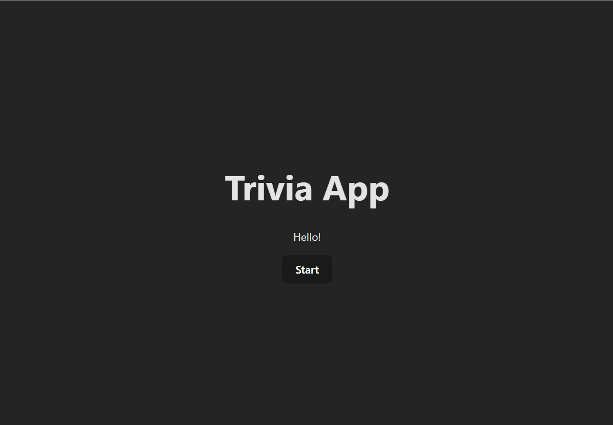
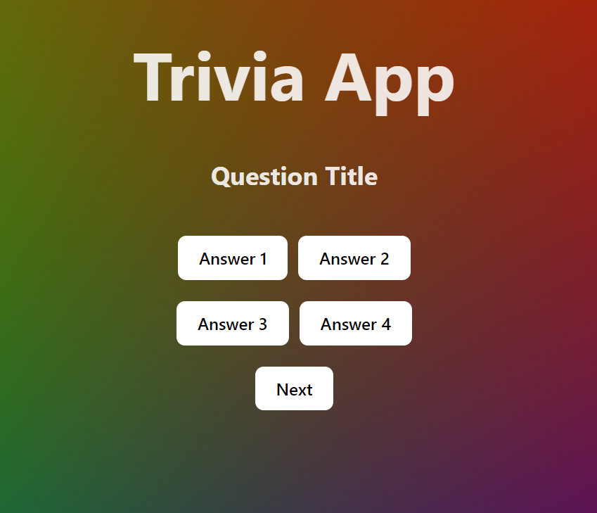
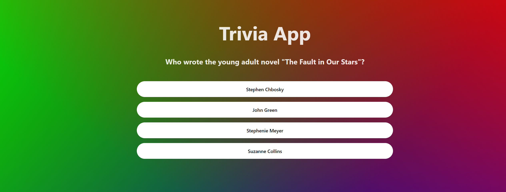

# Trivia App

Welcome to the trivia app where you can put your knowledge to the test. This app has been built using React Typescript.

## The MVP

- Create an interface that will allow a user to choose level of difficulty and start a new game
- When game starts, the user should see a question card with 4 possible answers
- If they answer the question correct, a new question should appear on the screen
- If their answer is incorrect, the game is over
- Display the score (number of question answered correctly) at the end of each game
- Add a "Play Again" button under the score

### Bonus

- Allow the user to select a category of questions
- Add a time countdown to each question, when a question is not answered before the time is up, game ends

## Process

To begin with, I separated out the components, as seen under the "components" folder.
In QuestionCard.tsx, I am fetching the questions from this <a href="https://opentdb.com/">API</a>.
I am using a useEffect to call useQuestions (which is fetching the API and its response).

To display the data, I am using conditional rendering. First, I check the variable gameOver (declared as a useState(false)) and if it's true we return the GameOver component, otherwise we are returning the question. The function getAnswer checks if the userAnswer is correct and either increases the points and progresses to the next question or it sets gameOver to true, thus triggering the GameOver component.

QuestionCard.tsx is being called by Menu.tsx when notActive is true (which occurs when the user clicks the "Start" button).

---------------------- 19/08/2024

After completing the MVP for the frontend, I have decided to venture into creating the backend myself to learn how to build an api and use CI/CD with Azure. See the "What I'm currently working on" section further down.

### Start menu:

### V1.0

 

### V1.2

With functional dropdown:
 

### After clicking the start button:

(V1.1)

 

(V1.2)

 

## Challenges

While building this app, I struggled with a few things which ultimately have given me more confidence:

- Handling the API response and getting it to display
- Handling types with TypeScript (I came across multiple type errors throughout the development process)
- Figuring out how to use .map to dynamically display values
- Testing with Vitest and React Testing Library (understanding how to translate my thought process into actual testing code was a challenge)

## What I'm currently working on:

- Implementing CI/CD in Azure with Azure Pipelines - currently, I have included a github actions workflow on the github repository which runs the frontend tests automatically.
- Containerising the backend with Docker and deploying the full stack app to Azure
- Allow the user to select a category of questions
- Add a time countdown to each question, when a question is not answered before the time is up, game ends

## Done!

- Handling answers which are HTML encoded (10/08/24 - Done! I simply used a HTML encoding/decoding library called html-entities)
- Adding tests

## How to Play

- Clone the repository to your local machine
- In a terminal, 'npm install' to install all necessary dependencies
- In a terminal, 'npm run' to start the app.
