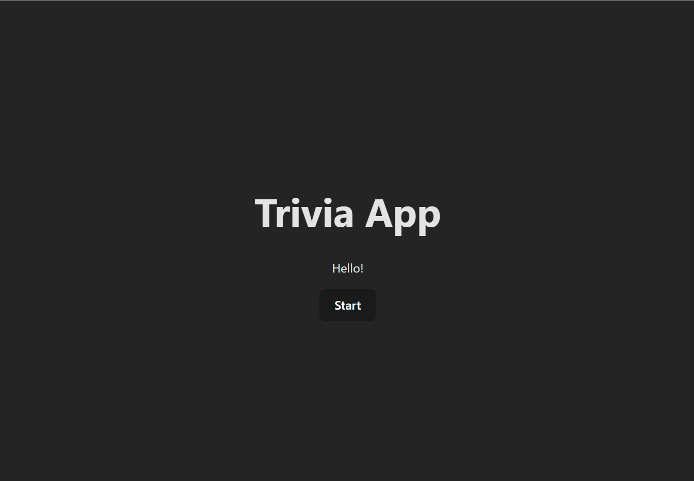
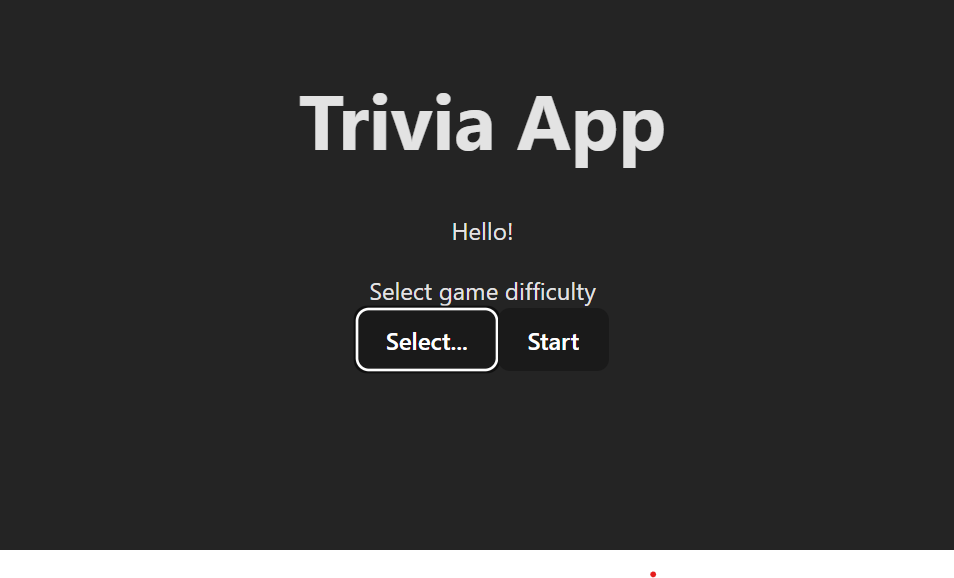
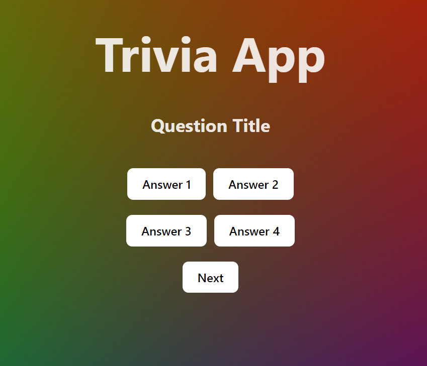
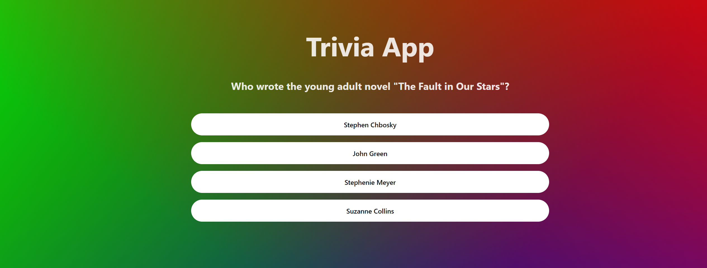

# Trivia App

Welcome to the trivia app where you can put your knowledge to the test. This app has been built using React Typescript.

## The MVP

- Create an interface that will allow a user to choose level of difficulty and start a new game
- When game starts, the user should see a question card with 4 possible answers
- If they answer the question correct, a new question should appear on the screen
- If their answer is incorrect, the game is over
- Display the score (number of question answered correctly) at the end of each game
- Add a "Play Again" button under the score

### Bonus

- Allow the user to select a category of questions
- Add a time countdown to each question, when a question is not answered before the time is up, game ends

## Process

To begin with, I separated out the components, as seen under the "functions" folder.
In QuestionCard.tsx, I am fetching the questions from this <a href="https://opentdb.com/">API</a>. Using the function RenderData, the data is (supposed to) be rendered. Currently, the data is not being rendered properly. QuestionCard.tsx is being called by Menu.tsx when (!visible) is true (which occurs when the user clicks the "Start" button).

### Start menu:

### V1.0

 

### V1.2

With functional dropdown:
 

### After clicking the start button:

(V1.1)

 

(V1.2)

 

## What I'm currently working on:

- Game over
